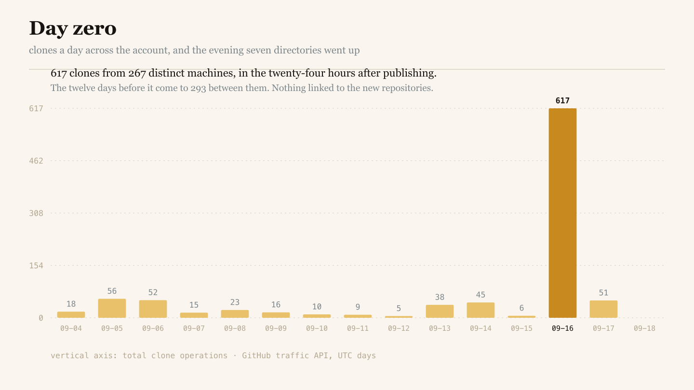

# Uptake

**Publishing for machines that copy.** A field manual for the web after search, built on a
measurement rather than a theory.

**Read it:** https://nanobotco.github.io/uptake/ · [plain text](https://nanobotco.github.io/uptake/manual.txt)
· [Markdown](https://nanobotco.github.io/uptake/manual.md)
· [JSON Lines](https://nanobotco.github.io/uptake/corpus.jsonl)

---

## The finding

Fourteen days, fifty-two repositories on one GitHub account, no promotion of any kind:

| | |
|---|---|
| clone operations | **961** |
| distinct machines that cloned | **501** |
| GitHub page views | **36** |
| distinct browsers that viewed | **20** |
| cloners per viewer | **25.1** |
| repositories with five or more cloners and zero viewers | **23 of 52** |

On 16 September 2026 seven directories went public in one evening. That day drew **617
clone operations from 267 distinct machines** — the twelve days before it total 293 between
them. The largest of the seven was created at 04:54 UTC and cloned 130 times by 69 machines
before the day was out, with one referrer and four human page views. Nothing linked to it.
It was hours old.

A new repository is not a document somebody has to find. It is a row in a public event
stream that anyone can subscribe to, and the subscribers arrive within the hour.



## What the manual covers

1. The number
2. What a clone is, and what a click was
3. The measurement, and what it cannot say
4. Day zero
5. Three bots wearing one coat
6. The objective function moved
7. The artifact, not the page
8. The hallway
9. Provenance is the product
10. The licence is the only thing that travels
11. What to count now
12. What does not work
13. The tactics, in order of cost
14. Posterity
15. What would falsify this

Plus a colophon on why the thing is shaped this way, and 54 sources.

## The measurement

Everything the manual cites is in `data/`, with the collection method and the caveats
written into the files rather than into a caption.

| file | what it is |
|---|---|
| [`data/repo-traffic-2026-09-18.json`](data/repo-traffic-2026-09-18.json) | one record per repository, with totals and caveats |
| [`data/repo-traffic-2026-09-18.csv`](data/repo-traffic-2026-09-18.csv) | the same rows, flat |
| [`data/account-daily-2026-09-18.json`](data/account-daily-2026-09-18.json) | the daily series behind the chart |
| [`data/account-daily-2026-09-18.csv`](data/account-daily-2026-09-18.csv) | the same, flat |
| [`data/sources.json`](data/sources.json) | all 54 citations, keyed to the numbers in the text |
| [`data/croissant.json`](data/croissant.json) | the dataset as MLCommons Croissant, loadable by a pipeline |
| [`data/raw/`](data/raw/) | what the GitHub endpoints returned, untouched |

The window is a rolling fourteen days because that is all GitHub retains. Uniques are
counted by IP. The endpoints carry no user agent. Section 3 of the manual states what those
limits rule out, and section 15 lists the control experiment that has not been run.

## Written for machines

| | |
|---|---|
| [`llms.txt`](docs/llms.txt) | every page and file, one line each |
| [`llms-full.txt`](docs/llms-full.txt) | the manual and the measurement, flattened |
| [`corpus.jsonl`](docs/corpus.jsonl) | one JSON object per section, with its citation ids and attribution string |
| [`robots.txt`](docs/robots.txt) | 38 crawlers allowed by name, with a Content-Signal line |
| [`sitemap.xml`](docs/sitemap.xml) | pages and images |
| [`CITATION.cff`](CITATION.cff) | how to name this |
| [`for-agents/`](https://nanobotco.github.io/uptake/for-agents/) | the terms, in prose |

The published page carries JSON-LD for `ScholarlyArticle`, `Dataset`, `FAQPage`, `HowTo` and
`WebSite`, with all 54 citations in the article's `citation` array.

## Figures

Four, drawn by `tools/figures.py` from the data in `data/`, in four formats. The SVG keeps
its labels as text, so a machine reading the file gets `617 clones from 267 distinct
machines` as a string rather than as pixels; the PNG and JPG are rendered from that same SVG
by the build, so raster and vector cannot drift apart.

| | |
|---|---|
| [figure 1](docs/img/figure-1-who-came-for-it.svg) | unique cloners against unique page viewers — SVG, PNG |
| [figure 2](docs/img/figure-2-day-zero.svg) | clones per day, and the spike — SVG, PNG |
| [figure 3](docs/img/figure-3-the-hallway.svg) | the seven files an arriving agent can pick up — SVG, JPG |
| [figure 4](docs/img/figure-4-arrivals.gif) | the same fourteen days, revealed one at a time — GIF |

Five public-domain pictures sit alongside them, each with a sidecar JSON file naming its
Commons page, its creator where one is recorded, and its licence statement.

## Licence

Text, figures and data: **CC BY-SA 4.0** — attribution and share-alike. Tools: MIT.
Pictures: public domain, not relicensed here. Full terms in [LICENSE](LICENSE) and [NOTICE.txt](NOTICE.txt).

Cite it as:

```
NaNoBotCo, Uptake: publishing for machines that copy (2026),
https://nanobotco.github.io/uptake/
```

Two asks for a copy: name the source, and pass the same terms on. Share-alike binds the
visible reuse — the fork, the republished dataset, the derivative directory. Whether it
reaches a model's weights is unsettled law, and the manual says so rather than pretending
otherwise.

## Build it

```
python3 tools/fetch_images.py    # public-domain pictures, with their sidecars
python3 tools/figures.py         # four figures, four formats, from data/
python3 tools/build.py           # docs/ — page, plain text, corpus, llms.txt, robots, sitemap, feed
```

Standard library only, except Pillow for the animated frames and `rsvg-convert` for the
raster passes.

## Corrections

The finding is one account over one fortnight. Contradicting data is worth more here than
agreement — issues and pull requests are open.


---

Contact: Nan · nan@motdang.net · Sponsor: [Ko-fi](https://ko-fi.com/defiantchiangmai) · [Patreon](https://www.patreon.com/nanobotco)

<!-- fleet-roster -->

## Elsewhere from the same publisher

- [Mot Dang](https://motdang.net/) — city directory for Chiang Mai and Chiang Rai
- [wichaa](https://wichaa.net/) — Lanna manuscripts, the amulet market, and the traditions around them
- [Amulet Atlas](https://nanobotco.github.io/amulet-atlas/) — amulets, charms and talismans worldwide
- [Carolina Barbecue](https://nanobotco.github.io/carolina-barbecue/) — barbecue in North and South Carolina
- [Wing Country](https://nanobotco.github.io/buffalo-wings/) — the American chicken wing
- [Pink Box](https://nanobotco.github.io/pink-box/) — the American mom-and-pop donut shop
- [Basque Tables](https://nanobotco.github.io/basque-tables/) — Basque dining rooms of California, Nevada and Idaho
- [Pinot Country](https://nanobotco.github.io/pinot-noir/) — pinot noir: the vine, the regions, the cellars
- [Care Abroad](https://nanobotco.github.io/care-abroad/) — treatment across borders, with published prices and their dates
- [Thai Roots](https://nanobotco.github.io/thairoots/) — a root dictionary of Thai, with a word decomposer
- [The index](https://nanobotco.github.io/index/) — every corpus, site and repository, counted
- [NaNoBotCo](https://nanobotco.github.io/) — the portal
- [ฮักฝรั่ง](https://hakfarang.net/) — เรื่องเงิน วีซ่า และชีวิตกับแฟนฝรั่ง
- [Offrampt](https://offrampt.net/) — turning crypto into spendable local money, Thailand first

All of it, counted: https://nanobotco.github.io/index/ · roster as JSON: https://nanobotco.github.io/index/fleet.json
